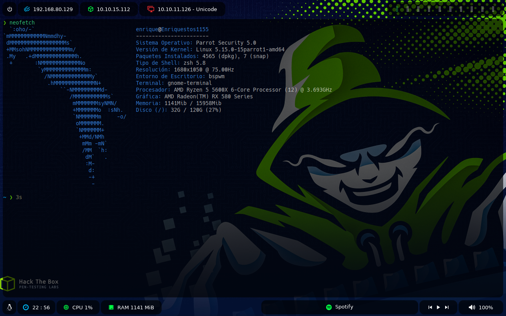

# Entorno de escritorio para HackTheBox

La idea de este repositorio es la de guardar la **configuración personal** 
de un entorno de escritorio usando **bspwn** pensada principalmente para 
ser usada en la resolución máquinas de HackTheBox.

## ¿Cómo se ve?



## Estructura
```
.
├── bspwm           # Tiling window manager.
├── picom           # Compositor independiente para Xorg.
├── polybar         # Herramienta para crear barras de estado.
├── sxhkd           # Configuración para teclas de acceso rápido.
├── wallpaper       # Imágen .jpg para ser usado como fondo de pantalla.
├── LICENSE
└── README.md
```
